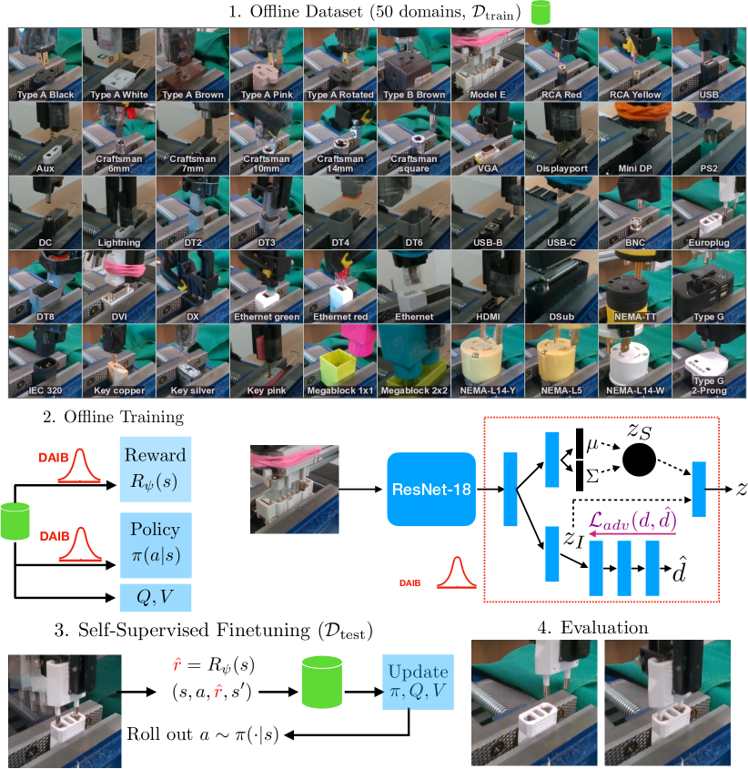
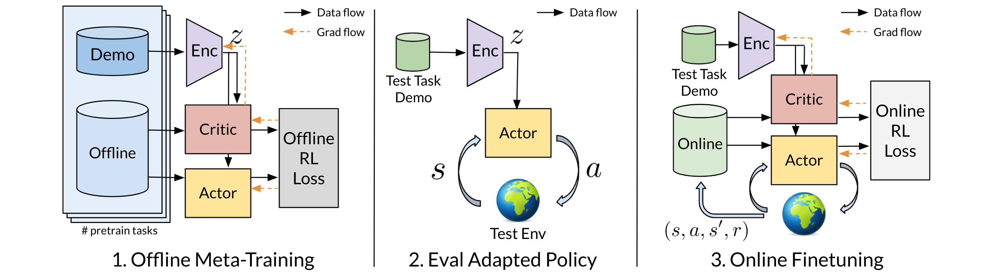
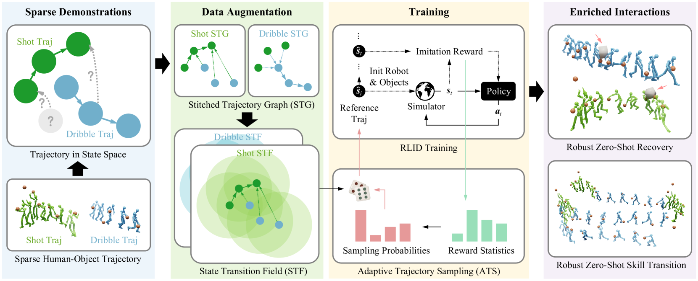

# 工业任务

## InsertionNet 2.0: Minimal Contact Multi-Step Insertion Using Multimodal Multiview Sensory Input

force，image，delta pose 都要输入，主干用resnet，三个输出头，一个预测delta pose控制机器人，一个 **Contrastive Head** 让正负样本训练主干的参数，一个 **Relation Head** 让参考state更接近来训练主干参数。示教一次找到正确位姿，让机械臂在周围随机移动获取delta pose和image对。

## EasyInsert: A Data-Efficient and Generalizable Insertion Policy

成功的插入依赖于插头与插座之间的相对位姿，而非精确的绝对位置。也是示教一次找到正确位姿，训练VA模型。用Diffusion预测delta pose。

## Learning on the Job: Self-Rewarding Offline-to-Online Finetuning for Industrial Insertion of Novel Connectors from Vision

在策略无法零样本泛化时，只要奖励函数能泛化，就可以让机器人自我评估、自我优化，从而在线微调完成新任务。

## Offline Meta-Reinforcement Learning with Demonstration Adaptation

直接用元策略在新任务上做 online RL 微调很慢，反而是加入示范再进行 fine-tune，会显著提高 sample efficiency 和初始 performance。示范的Enc能提取插入任务中的关键信息，从而让Actor和Critic都更聪明。**demo context**：由若干人类demo轨迹组成，每条轨迹包含sars'。

# VLAs

# 数据生成

## *DemoGen:* Synthetic Demonstration Generation for Data-Efficient Visuomotor Policy Learning

用一条人工演示，合成大量数据。把演示轨迹分解为“自由空间移动段”和“接触操作段”，自由段通过运动规划重新生成；接触段整体变换。把输入视觉分割出物体和背景，然后拼接成新的位置。

Too many manual processes. 

## **SkillMimic: Learning Basketball Interaction Skills from Demonstrations**

**用了一个“模仿学习式”的奖励函数来做强化学习**。教机器人skill，用一种“统一的模仿奖励”，替代每种技能都要单独设计的奖励。这个统一奖励叫做 **HOI imitation reward**，可以度量机器人的状态和人类示范的**相似度**。

## SkillMimic-V2: Learning Robust and Generalizable Interaction Skills from Sparse and Noisy Demonstrations

数据增强策略。**1. 拼接轨迹（STG）**把不同演示片段之间用“合理的中间状态”连起来，比如：只有“运球片段”和“投篮片段”，STG 会构造可能的“运完球直接投篮”的轨迹。**2. 状态邻域扩展（STF）**对每个演示状态，找出它周围（ε-邻域）的一系列可能起始状态；并构建“指向原演示”的过渡路径，即“这附近的状态怎么进到已知轨迹里”。

这两篇本质上都是图形学研究，纯仿真。

# 动作生成和预测

## MEgoHand: Multimodal Egocentric Hand-Object Interaction Motion Generation

从一个**不完整的第一人称视频 + 一点文字提示 + 起始手部姿态**中，**推理出一整段完整的 3D 手部运动轨迹**。VLM+深度图作为大脑，**DiT-based Flow-Matching Policy Network**+**Temporal Orthogonal Filtering**作为小脑。方法可以在robo领域参考。

## Human Motion Prediction under Unexpected Perturbation

专注于由非预期外部力（如推力）引起的反应性运动，这类思想在VLA上应该能用上。

## 3D Human Motion Prediction : A Survey 大综述

## On human motion prediction using recurrent neural networks

打脸前文的开山作，专注于短期预测。很多 SOTA 模型（如 ERD、LSTM-3LR、SRNN）在短期预测中甚至**不如一个“恒定姿态”（Zero-velocity）基线**，即：直接预测下一帧 = 当前帧。这些深度模型通常训练目标是短期误差，但又希望在长期生成中保持真实，结果两头不靠。

**Sequence-to-sequence + Residual 架构**

- 用 seq2seq 框架建模动作序列。
- **Encoder-Decoder 共享权重**，加快训练。
- Decoder 预测的是“当前帧相对前一帧的残差（即速度）”，而不是绝对角度。
  - **残差建模 = 速度建模**，使预测更加连续。
  - 最终仍用角度作为损失计算，防止偏移。

**Sampling-based Training（不喂GT）**

- 不像其他方法每一步都喂 Ground Truth，而是让 decoder 自己预测并用预测作为下一帧输入。
- 更接近真实推理场景，训练稳定，不需要调噪声参数。

**多动作（multi-action）训练**

- 不再为每类动作训练单独模型，而是使用一个统一模型 + one-hot 编码指定动作类别。
- 这样能利用 Human3.6M 数据中跨动作的结构相似性，提高泛化能力。

## Learning Trajectory Dependencies for Human Motion Prediction

**DCT建模时间依赖（Temporal Modeling）**

- **传统方式**：用RNN或时序卷积（Temporal Conv）显式建模时间序列。
- **本方法**：把每个关节的运动轨迹表示为DCT系数，即在“trajectory space”中建模，而非直接在姿态空间里回归未来帧。
  - 类似频域建模，能自然捕捉到运动的平滑性。
  - DCT还可以通过去掉高频分量减少抖动和过拟合。

**GCN建模空间依赖（Spatial Modeling）**

- **传统方式**：使用人体运动的运动学树（Kinematic Tree）或者手动定义卷积核大小。
- **本方法**：将人体姿态建模为**完全连接图（fully-connected graph）**，并**学习邻接矩阵A**（Graph结构是可学习的），更灵活地捕捉远距离的关节依赖，如左右对称性、上肢-下肢协调等。

这篇就是LTD，可以作为基础尝试

## CacheFlow: Fast Human Motion Prediction by Cached Normalizing Flow

其他方法能生成轨迹的概率分布，但是很慢。如果搞个缓存就能把速度加快起来。

CacheFlow 的“很快”是相对于其他 stochastic 方法（VAE, Diffusion, Flow），而不是相对于 LSTM。如果只要预测一个动作，当然可以用 LSTM 这种 deterministic 方法，但它无法表示“未来的不确定性”——这正是 CacheFlow 和其他概率模型的目标所在。

## Existence Is Chaos: Enhancing 3D Human Motion Prediction with Uncertainty Consideration

都是在Human3.6M、3DPW、CMU Mocap这几个数据集上跑的。**引入“未来不是唯一答案”的观点**，强调不确定性在运动预测中的重要性。关注点在生成的运动**更稳定、自然、少抖动**。

## LAL: Enhancing 3D Human Motion Prediction with Latency-aware Auxiliary Learning

现有方法假设机器人能**“即时反应”**，即预测完成后立即执行；但在现实中，从感知 → 预测 → 决策 → 执行动作，系统会有**不可避免的反应延迟（latency）**（如几十到几百毫秒）；这使得预测的**初始部分**已经“过时”，变得**对控制无意义**。延迟区间虽然不可用于实际控制，但它包含了有价值的运动信息，可以作为“辅助学习任务”，来提升有效预测部分的准确率。

setting和我们的场景比较像，能抗很高的延迟，结果和其他比差距不大。和上一篇都用LTD、SPGSN、PGBIG、DMGNN当benchmark。

## Head and Body Motion Prediction to Enable Mobile VR Experiences with Low Latency

## Motion Prediction and Pre-Rendering at the Edge to Enable Ultra-Low Latency Mobile 6DoF Experiences

用MLP预测头部3dof，LSTM预测手部6dof。推理频率能到90hz，差距不太大就用预测的，差距太大就回滚到旧数据。

## Adaptive Human Motion Prediction using Multiple Model Approaches

同时运行多个不同种类的KF，每个预测都有一个权重（由误差反比决定）。动态添加/删除模型，避免计算瓶颈。结果比运行**Double Exponential Smoothing**略微好一点点。

# 视频中学习

## Object-centric 3D Motion Field for Robot Learning from Human Videos

非常复杂的训练流程。从**3D Motion Field**里面提取动作，然后证明这种动作表示方式比光流或者点云流更好。花里胡哨的。

从视频中学习需要对齐两件事，一个是state，一个是action。

state就是训练的视角和部署的视角要是一样的，如果不一样，你就需要用一个中间表征。当然最简单的方式就是让他们视角一致。

action就是这里花哨的地方。如果你在视频中直接提取SE3，那就能直接用于部署机器人的时候给机器人执行，但如果你提取**3D Motion Field**（一个能从视频里提取、但又与机器人行为相关的“**任务中立的动作标签**”），那就需要经过一次转换，从3D Motion Field到SE3再到机器人IK执行。流程复杂了很多，但没有明显收益。

# 意图预测

## Context-aware collaborative pushing of heavy objects using skeleton-based intention prediction

它提出了一种基于**Skeleton + 时空图神经网络（Directed Graph Neural Network, DGNN）**用人的身体姿态”来预测意图，从而协助人搬运重物，证明了确实能省力。我们可以考虑用GNN来做少部分物体和机器人的意图预测。

# 其他

## Differentiable Robot Rendering

想要实现看图控制机器人。**从“机器人动作参数” → 渲染出一张图像的过程**，还必须是“可微分”的，才能做优化：让机器人动一下 → 渲染出图像 → CLIP 判断这个图像好不好 → 根据 CLIP 的反馈再调动作 → 再渲染 → 再反馈…… 直到机器人动作“看起来对”。于是需要前向的“从关节角度到图像”的渲染过程。

## AVR: Active Vision-Driven Robotic Precision Manipulation with Viewpoint and Focal Length Optimization

实时变焦增强遥操，提供显式的attention。
